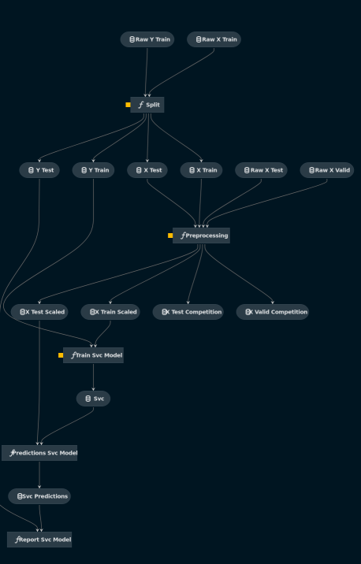

# Predictions of protein function

# Overview

This project is a Machine Learning project done during the [HPC-AI master](https://www.hpc-ai.mines-paristech.fr/en/homepage/).

You can discover instructions [here](instructions.md).

We used different tools to make our models such as :
- [Scikit-Learn](https://scikit-learn.org/stable/)
- [Pytorch](https://pytorch.org/)
- [XGBoost](https://xgboost.readthedocs.io/en/latest/)

And also [Kedro](https://github.com/kedro-org/kedro) for creating reproducible, maintainable and modular data science code.

# Models

There are 3 models implemented :
- Support Vector Classifier (SVC)
- Multilayer Perceptron (MLP)
- XGBoost Classifier (XGBoost)

# Pipelines

## SVC

## MLP

## XGBoost

# Grid Search

In the folder `grid-search`, you can get an idea of how we made a grid search
